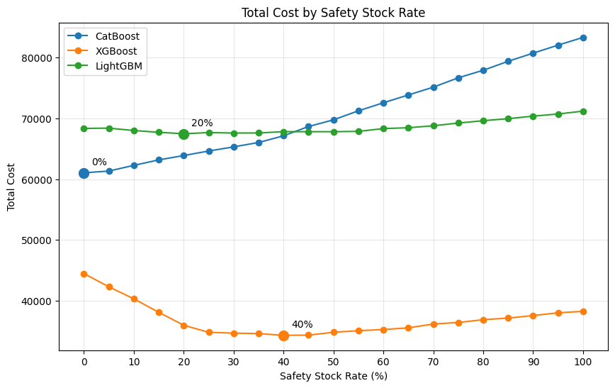

# 품절과 과잉재고 비용을 고려한 안전재고 정책은 어떻게 결정할 수 있는가?

## 분석 방법

데이터 전처리 및 수요예측 모델 구축은 [예측 오차에 따른 재고 수준 분석](https://github.com/skyup-509/SCM_Forecast)의 데이터 전처리 및 수요예측 과정을 동일하게 활용합니다.

본 프로젝트에서는 동일한 수요예측 결과를 활용하여 **안전재고율을 변화시키고, 이에 따른 재고 운영 결과의 변화를 분석**합니다.

- **공통 분석**: 데이터 전처리 및 CatBoost·XGBoost·LightGBM 기반 수요예측
- **안전재고 분석**: 안전재고율을 단계적으로 변화시켜 재고 수준 산출
- **성과 분석**: 안전재고율에 따른 품절 및 과잉재고 변화 비교
- **최적화**: 안전재고율별 총비용을 계산하여 모델별 총비용이 최소가 되는 안전재고율 탐색

## 비용 산정

실제 기업의 재고 비용 데이터를 사용할 수 없으므로, 품절과 과잉재고의 상대적인 비용을 가정하여 총비용을 산정하였다.

- **비용 가정**: 품절 1개가 과잉재고 1개보다 10배 높은 비용을 발생시킨다고 가정

	`품절 비용 계수: 1, 과잉재고 비용 계수: 0.1`

## 안전재고 정책 최적화

### Objective Function

$$
s^* =
\underset{s \in S}{\arg\min}
\left[
\sum_i
Q_{\text{stockout},i}(s)
\times P_i
+
0.1
\sum_i
Q_{\text{excess},i}(s)
\times P_i
\right]
$$

$$
S = \{0, 0.05, 0.10, \dots, 0.95, 1.00\}
$$

- $Q_{\text{stockout},i}$: SKU $i$의 품절 수량
- $Q_{\text{excess},i}$: SKU $i$의 과잉재고 수량
- $P_i$: SKU $i$의 단가
- 품절 비용 계수: 1.0
- 과잉재고 비용 계수: 0.1

-  안전재고율 $s$ 탐색 범위
	+ **범위**: 0 ~ 100%
	+ **간격**: 5%p
	+ **총 21개** 후보

## 결과

### 안전재고율에 따른 재고 운영 변화

- 안전재고율이 증가할수록 예측 수요에 추가되는 재고가 증가하므로, 일반적으로 품절량은 감소하고 과잉재고량은 증가하는 형태의 상충관계 확인
- 단순히 안전재고를 많이 확보하는 것이 아니라, 품절 비용과 과잉재고 비용을 함께 고려하여 적정 수준을 탐색하였다.

### 모델별 최적 안전재고율

각 모델의 안전재고율별 총비용을 비교하여 **현재 설정한 비용 구조와 탐색 범위에서 총비용이 최소가 되는 안전재고율**로 설정했다.

| Model    | Safety Stock Rate | Total Cost | Stockout Quantity | Excess Inventory |
| -------- | ----------------: | ---------: | ----------------: | ---------------: |
| CatBoost |                0% |   61,127.2 |             300.1 |          2,366.7 |
| LightGBM |               20% |   69,049.9 |             623.5 |          1,857.2 |
| XGBoost  |               45% |   34,262.0 |              83.6 |          1,836.1 |


```
안전재고율을 고정으로 설정하기보다 예측 결과와 품절 및 과잉재고 비용을 함께 고려하여 안전재고 수준을 결정할 필요가 있다.
```



| 모델       |    MAE |   Bias | 최적 안전재고율 |
| -------- | -----: | -----: | -------: |
| CatBoost | 102.57 | -79.48 |       0% |
| XGBoost  |  54.02 | -26.71 |      45% |
| LightGBM |  84.85 | -28.92 |      20% |


- CatBoost는 **음의 Bias**를 보여 실제 수요보다 **높게 예측**하는 경향이 나타났으며, 현재 비용 가정과 탐색 범위에서는 추가 안전재고가 없는 0%에서 총비용이 최소로 나타났다.
- 그래프를 보면, XGBoost는 안전재고율이 증가함에 따라 총비용이 감소하다가 **45%에서 최소가 된 후 다시 증가**하는 형태가 나타난다.


